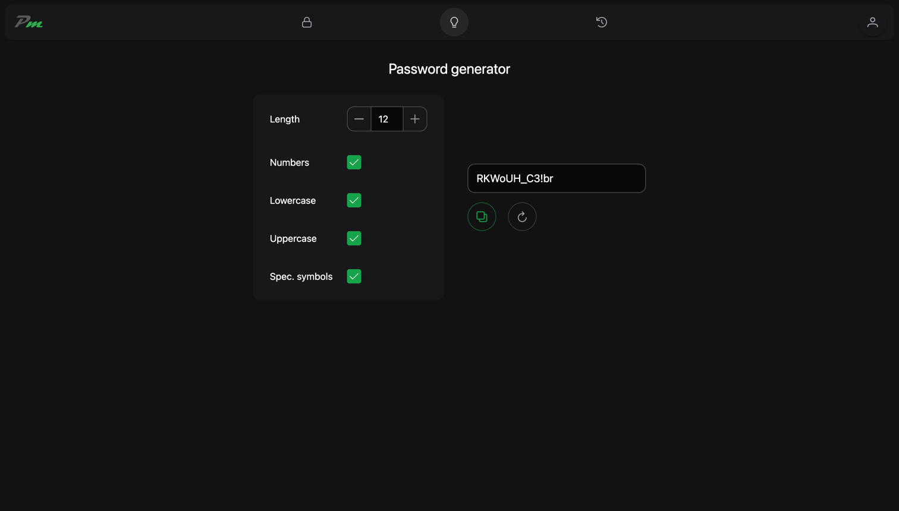
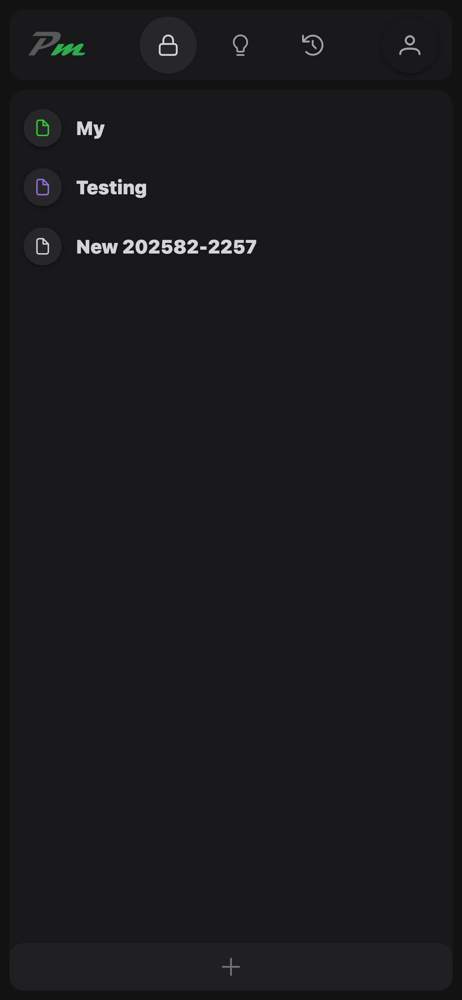
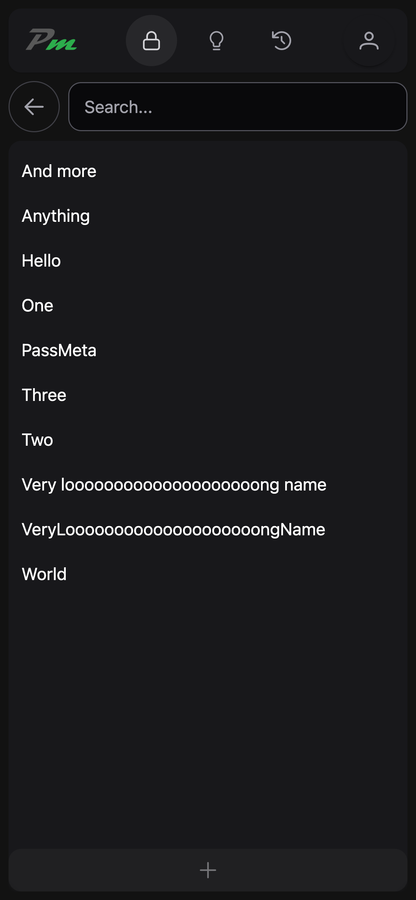
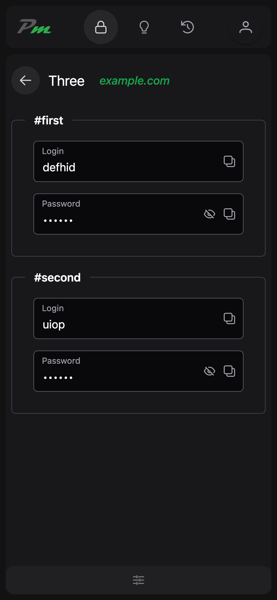
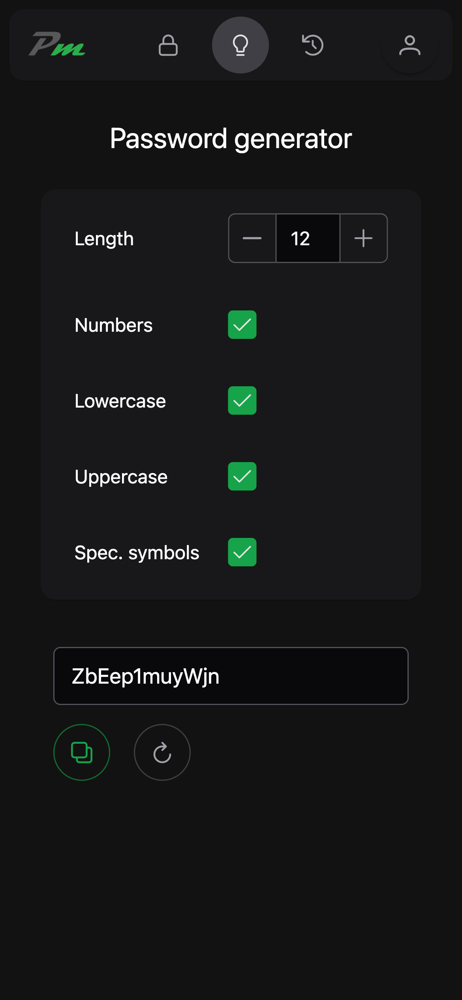
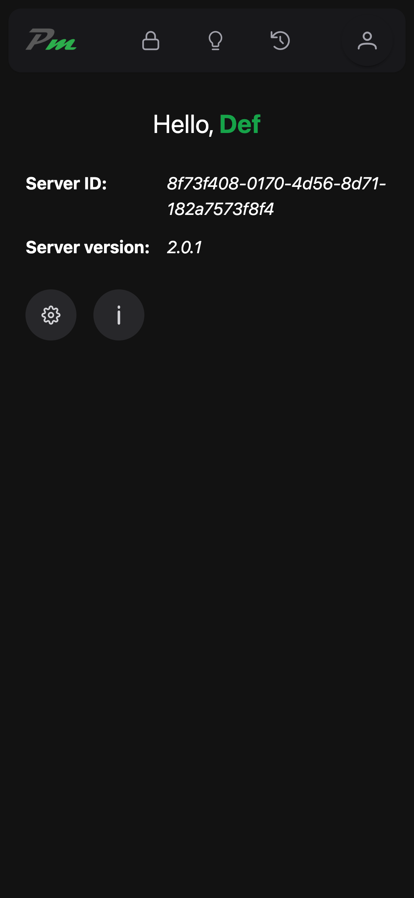
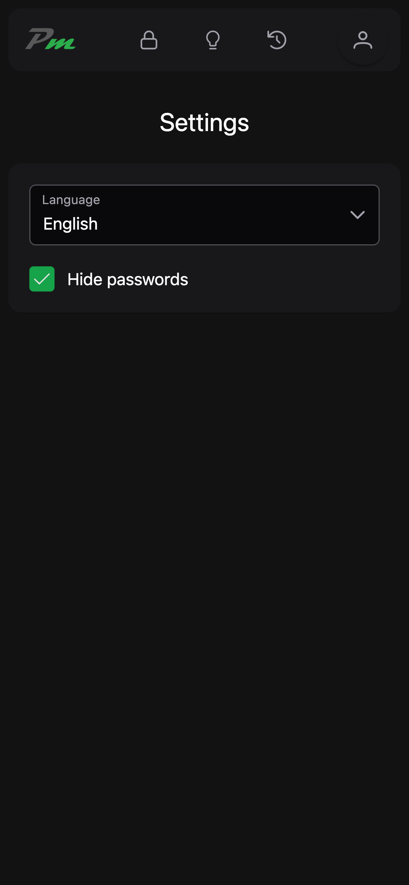

# PassMeta Web App

#### © 2025 Vladislav Mironov

## About the project

PassMeta WebApp is a web client application of PassMeta System.

Status: MVP.

### Technologies

_Vue.js, TypeScript, Tailwind, Vite, PrimeVue_<br>
PWA<br>
Feature-Sliced-Design<br>
AES256 multipass (client side only), SHA256

## Screenshots




<div style="display: grid; grid-template-columns: 1fr 1fr 1fr; gap: 5px;">
  
  
  
  
  
  
</div>

## Development

#### Prepare

```sh
yarn install
yarn run prepare
```

#### Run and hot-reload for Development

```sh
yarn run dev
```

#### Compile and minify for Production

```sh
yarn run build
```

## Deployment on Linux

- **Install [Docker](https://docs.docker.com/engine/install/ubuntu)**
- **Install utils:**
    - `sudo apt-get update`
    - `sudo apt install unzip nano`
- **Download and unzip:**
    - `wget https://github.com/defhid/PassMeta-WebApp/archive/refs/heads/master.zip`
    - `unzip master.zip`
    - `rm master.zip`
    - `mv PassMeta-WebApp-master /home/passmeta-ui`
- **Configure:**
    - `nano /home/passmeta-ui/deploy/.env.local`, enter `VITE_PASSMETA_API` (backend URL).
    - `cp /home/passmeta-ui/deploy/scripts/update.sh /home/passmeta-ui-update.sh`
- **Build:** `sudo bash /home/passmeta-ui/deploy/scripts/rebuild.sh`
- **Start:** `sudo bash /home/passmeta-ui/deploy/scripts/start.sh`
- **Stop:** `sudo bash /home/passmeta-ui/deploy/scripts/stop.sh`
- **Update:** `sudo bash /home/passmeta-ui-update.sh`
