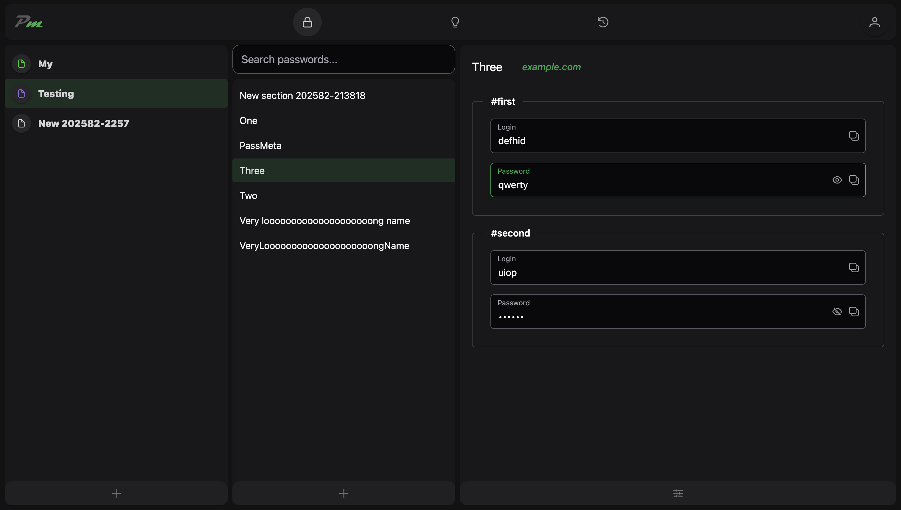

# PassMeta Web App

#### © 2025 Vladislav Mironov

### About the project

PassMeta WebApp is a web client application of PassMeta System.

Status: MVP (authentication, decryption and view)

### Technologies

_Vue.js, TypeScript, Tailwind, Vite, Vuetify._

### Screenshots



### Project Setup

```sh
yarn install
yarn run prepare
```

### Compile and Hot-Reload for Development

```sh
yarn run dev
```

### Compile and Minify for Production

```sh
yarn run build
```
